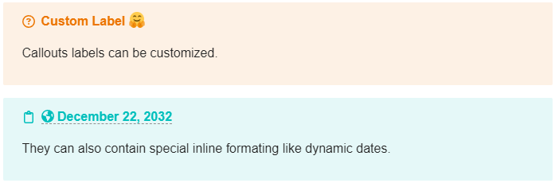
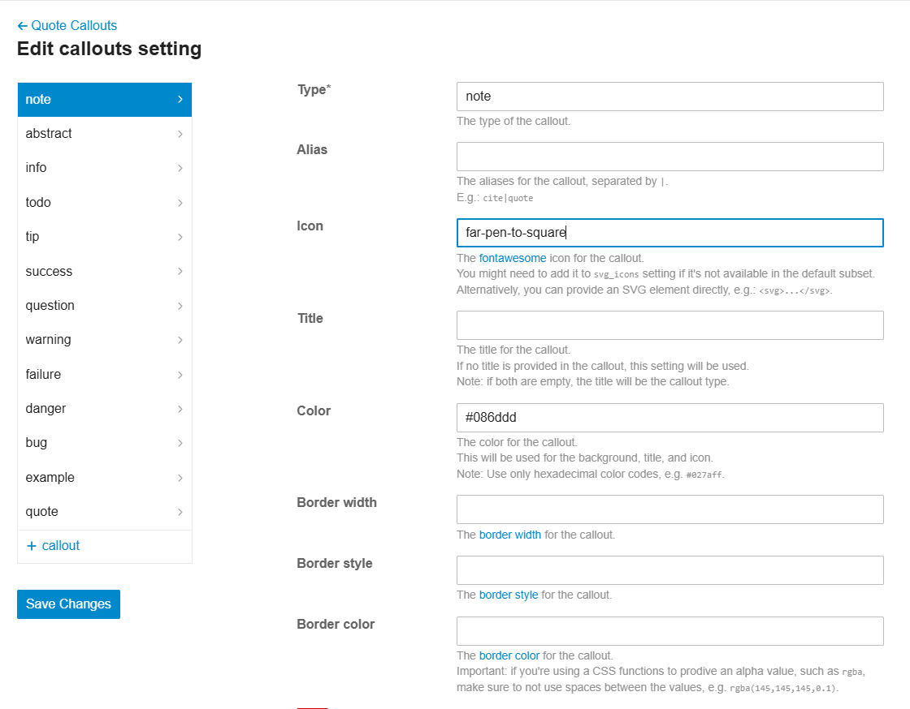
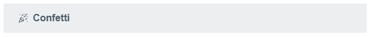

This theme component adds support for [Obsidian-style callouts](https://help.obsidian.md/Editing+and+formatting/Callouts) in Discourse as an alternative for markdown quotes.
Callouts are a great way to highlight content, add notes, warnings, or other special messages in your posts.


## Usage

To create a callout, add `[!type]` to the first line of a quote, where `type` is the type identifier. The type identifier determines how the callout looks and feels. To see all available types, refer to Supported types.

> ℹ️ The type identifier is case-insensitive.

```markdown
> [!tip] > **Tip**: Use `code snippets` to enhance readability. They provide clarity and precision.
```


### Custom title

By default, the title of the callout is its type identifier in title case. You can change it by adding text after the type identifier:

```markdown
> [!question] Custom Label 🤗
> Callouts labels can be customized.

> [!abstract] [date=2032-12-22 timezone="Europe/Paris"]
> They can also contain special inline formating like dynamic dates.
```



You can also create title-only callouts:

```markdown
> [!success] solved.
```


### Foldable callouts

You can make a callout foldable by adding a plus `+` or a minus `-` directly after the type identifier.

- `+` expands the callout by default
- `-` collapses it instead

```markdown
> [!todo]- My Todo List
>
> - [x] Write documentation
> - [ ] Add tests
> - [ ] Review code

> [!todo]+ My Expanded Todo List
>
> - [x] Create repository
> - [ ] Setup CI/CD
> - [ ] Deploy to production
```


### Nested callouts

You can nest callouts in multiple levels.

```markdown
> [!question] Can callouts be nested?
>
> > [!todo] Yes!, they can.
> >
> > > [!example] You can even use multiple layers of nesting.

> [!tip]
> Here's a helpful tip
>
> > [!info]
> > With some additional information
> >
> > > [!example]
> > > And a nested example
>
> Back to the main tip
```


## Supported default types

You can use several callout types and aliases.
Each type comes with a different background color and icon.

> ℹ️ You can create your callouts or manage the default ones.
> See the Settings section below.

> ℹ️ Any unsupported type defaults to the `note` type. See Default Fallbacks section for more information.

> ℹ️ The type identifier is case-insensitive.

| Type       | Description                        | Aliases                |
| ---------- | ---------------------------------- | ---------------------- |
| `note`     | For general notes and information  | -                      |
| `abstract` | For summaries or abstract sections | `summary`, `tldr`      |
| `info`     | For informational content          | -                      |
| `todo`     | For task lists or todo items       | -                      |
| `tip`      | For tips and important information | `hint`, `important`    |
| `success`  | For success messages               | `check`, `done`        |
| `question` | For questions and FAQs             | `help`, `faq`          |
| `warning`  | For warnings                       | `caution`, `attention` |
| `failure`  | For failure notices                | `fail`, `missing`      |
| `danger`   | For danger or error messages       | `error`                |
| `bug`      | For bug reports or known issues    | -                      |
| `example`  | For examples                       | -                      |
| `quote`    | For quotes                         | `cite`                 |


## Settings

| Setting | Description |
|------|-------------|
| **callouts**                   | Define the callouts.                                                                                               |
| **callout_fallback_type**      | The default callout type to use when the specified type is not found.<br><small>Default value: `note`</small>      |
| **callout_fallback_icon**      | The default icon to use when the specified type is not found.<br><small>Default value: `far-pen-to-square`</small> |
| **callout_fallback_color**     | The default color to use when the specified type is not found.<br><small>Default value: `#027aff`</small>          |
| **callout_background_opacity** | The global background opacity for the callout (1 to 100).<br><small>Default value: `10`</small>                    |
| **callout_border_width**       | The global border width for the callout.<br><small>Default value: `empty`</small>                                  |
| **callout_border_style**       | The global border style for the callout.<br><small>Default value: `empty`</small>                                  |
| **callout_border_color**       | The global border color for the callout.<br><small>Default value: `empty`</small>                                  |
| **callout_border_radius**      | The global border radius for the callout.<br><small>Default value: `var(--d-border-radius)`</small>                |
| **callout_padding**            | The global padding for the callout.<br><small>Default value: `0.75em 0.75em 0.75em 1.5em`</small>                  |
| **callout_title_font_size**    | The global font size for the callout title.<br><small>Default value: `inherit`</small>                             |
| **callout_title_font_weight**  | The global font weight for the callout title.<br><small>Default value: `bold`</small>                              |
| **callout_title_gap**          | The global gap between the callout icon and title.<br><small>Default value: `0.5em`</small>                        |
| **svg_icons**                  | List of FontAwesome 6 icons used in this theme component. |

Callouts edition page:


## Customization

### Icon

You can use either [FontAwesome 6](https://fontawesome.com/v6/search?ic=free) icon or you can directly provide an SVG element.

#### SVG element

While the free FontAwesome version provides a great variety choices, you may be feel limited sometimes.
You have the ability to provide a SVG element `<svg>...</svg>`.

Example: [Lucile icons](https://lucide.dev/icons/) -- It's a great set with the advantages you can choose the stroke width.

1. Select an icon
2. Adjust the Stroke width
3. Click on <kbd>Copy SVG</kbd>
4. Go the theme component settings and paste the content




### Default Fallbacks

You can set default values for when a specified callout type isn't found with the following settings:

- `callout_fallback_type`
- `callout_fallback_icon`
- `callout_fallback_color`

## Global

## Roadmap

Future development plans may include:

- Autocomplete types on typing

## Credits

- @StefanoCecere -- Feature request, https://meta.discourse.org/t/style-blockquotes-as-callouts-in-obsidian/350045
